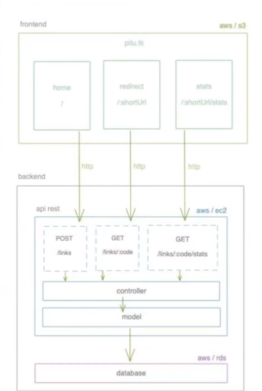

<h1 align="center">
    
</h1>

<h1 align="center">PITU - A simple micro-SaaS for URL shortening</h1>

<h2 align="center">🚧 Em Desenvolvimento 🚧</h2>
<h1 align="center">Semana Web Full Stack</h1>

<p align="center">
  

 

  <a href="https://github.com/tgmarinho/nlw1/commits/master">
    
  </a>

</p>

## 💻 Sobre o projeto

O Pitu 🦐 é um projeto ( micro-SaaS - Software as a Service ) que faz a função de encurtador de URL´s, similar ao
[bitly](https://bitly.com/), que pega urls grandes faz o encurtamento e contabiliza as mesmas, armazenando em um banco MySql.

### Diagrama do Projeto

<h2 align="center">
    
</h2>

### Telas do Projeto

## 🛠 Tecnologias

As seguintes ferramentas foram usadas na construção do projeto:

- [NodeJS](https://nodejs.org/en/)
- [ReactJS](https://pt-br.reactjs.org/)
- [MySql](https://www.mysql.com/products/community/)

## 🚀 Como executar o projeto

Podemos considerar este projeto como sendo divido em duas partes ( MonoRepo ):

1. Back End (pasta backend)
2. Front End (pasta frontend)

💡 O Front End precisa que o Back End esteja sendo executado para funcionar.

### Pré-requisitos

Antes de começar, você vai precisar ter instalado em sua máquina as seguintes ferramentas:
[Git](https://git-scm.com), [NodeJS]().
Além disto é bom ter um editor para trabalhar com o código como [VSCode]()

### 🎲 Rodando o Back End (servidor)

```bash
# Clone este repositório
$ git clone https://github.com/brunoemferreira/pitu.git

# Acesse a pasta backend
$ cd backend

# execute o comando 
$ yarn start  
ou
$ npm start

# O servidor inciará na porta:3000
```

### 🧭 Rodando a aplicação web (Front End)

```bash
# Clone este repositório
$ git clone https://github.com/brunoemferreira/pitu.git


```
